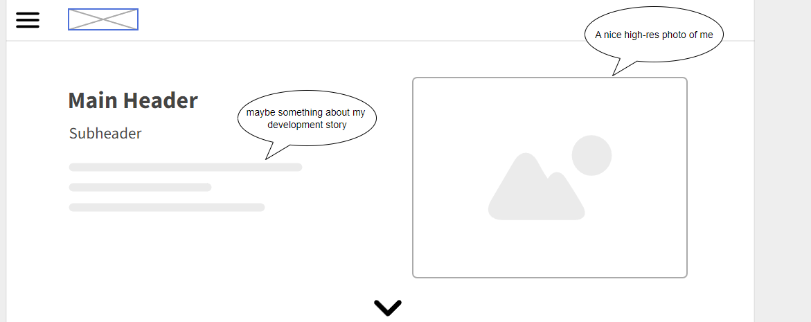

# Blog layout mockup
### Blog desktop layout main

* Hamburger menu in top left for better accessability to other projects i have made
* Main header for my name or a title such as "tryons blog"
* Subheader with unknown info
* Paragraph under subheader possibly describing my journey as a developer
* Down arrow to move to projects section

### Project section of blog

* Project Header
* Description of Projects/More to come
* Project images preview
* Buttons to projects

### Mobile layout

* Hamburger menu in top left
* Main header similar to desktop
* Subheader similiar to desktop
* Area to add more for user
